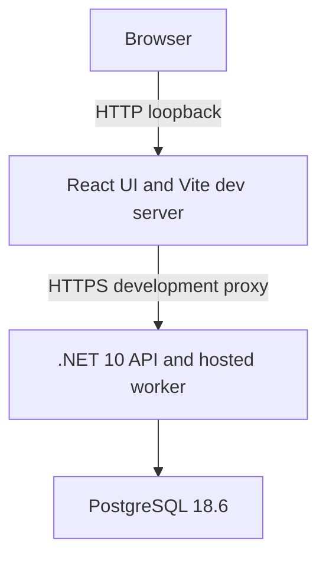

# Integration Ops

Integration Ops is a reference implementation of idempotent request intake and durable background processing, built with .NET 10, PostgreSQL and React.

An API accepts integration runs, a hosted worker processes them, and an operator view displays their current state. Synthetic operations make success, retry, failure and restart recovery reproducible without connecting to external systems. All sample data is fictional.

## Architecture



The API and worker share one host. Endpoint and processing code use EF Core directly; there is no separate worker service, message broker or repository abstraction. PostgreSQL coordinates both request acceptance and processing ownership.

- **Idempotent acceptance:** insert-first database arbitration resolves concurrent requests. Reusing a key with equivalent input returns the existing run's current state; different input returns a conflict.
- **Durable processing:** short database transactions allocate work and record completion. Execution runs outside the transaction. Leases and attempt tokens prevent stale workers from overwriting authoritative state.
- **Explicit failure handling:** bounded retries, expired-lease recovery and application-controlled error codes distinguish retryable failures from terminal outcomes.
- **Explicit schema management:** checked-in EF migrations and a separate synthetic-seed command keep schema and sample changes out of normal startup.

The React/TypeScript UI runs separately through Vite during development. It displays a snapshot, including loading, empty and failure states; reload to see changes. There is no submission form or automatic polling.

## Prerequisites

- .NET SDK 10.0.400, with patch roll-forward configured by `global.json`
- Node.js `^22.22.2`, `^24.15.0` or `>=26.0.0`
- npm 11.0.0 or later
- PowerShell 7.1 or later for the commands below and `scripts/Verify.ps1`
- A trusted workstation-local Linux Docker engine and Docker Compose for interactive use; local Docker Desktop with WSL2 is supported. Disposable Testcontainers verification can also use a trusted remote engine.

Trust the local certificate once if needed:

```powershell
dotnet dev-certs https --trust
```

## Database Setup

Only PostgreSQL is containerized. Confirm the effective Docker endpoint is local to this workstation before supplying credentials or starting/resetting Compose resources. Published loopback addresses and named volumes belong to the Docker engine host, not necessarily the terminal's machine. Remote engines are supported only for disposable Testcontainers verification, not this interactive setup.

From the project root:

1. Copy `.env.example` to the ignored `.env` and replace both placeholders with distinct private passwords. Keep the file local; do not source it into the API process.
2. Start the database:

```powershell
docker compose --env-file .env up -d --wait postgres
```

Compose publishes PostgreSQL only on `127.0.0.1:5432` and persists data in a named volume. The PostgreSQL 18.6 image is pinned by digest in [compose.yaml](compose.yaml). On an empty volume, initialization creates the `integration_ops_dev` database and its dedicated `integration_ops` login. The login owns the development database for migrations but cannot create roles or databases and is not a superuser.

3. Configure the application's dedicated login through User Secrets:

```powershell
$connection = [System.Data.Common.DbConnectionStringBuilder]::new()
$connection.set_ConnectionString('Host=127.0.0.1;Port=5432;Database=integration_ops_dev;Username=integration_ops')
$connection.set_Item('Password', (Read-Host 'Application password from .env' -MaskInput))
@{ 'ConnectionStrings:IntegrationOps' = $connection.get_ConnectionString() } | ConvertTo-Json -Compress |
    dotnet user-secrets set --project src/IntegrationOps.Api/IntegrationOps.Api.csproj
$connection.Clear()
```

Enter the application password from `.env`, not the bootstrap administrator password. The prompt avoids PowerShell string interpolation; the builder quotes connection-string values correctly. Alternatively supply `ConnectionStrings__IntegrationOps` in the API process environment. Keep credentials out of source and logs; User Secrets are local development storage, not a production secret store.

4. Build, migrate and seed explicitly:

```powershell
dotnet tool restore
dotnet restore IntegrationOps.slnx --locked-mode -warnaserror
dotnet build IntegrationOps.slnx --no-restore -warnaserror
dotnet ef database update --no-build --project src/IntegrationOps.Api/IntegrationOps.Api.csproj -- --environment Development
dotnet run --no-build --no-launch-profile --project src/IntegrationOps.Api/IntegrationOps.Api.csproj -- --environment Development --seed-synthetic
```

The seed installs three fictional snapshots and exits without starting HTTP or processing. Repeating it leaves matching samples and unrelated rows unchanged; conflicting sample content causes a rollback. Normal API startup never migrates or seeds. Stop all API instances before applying migrations. Intake and processing downgrades reject incompatible state rather than deleting or coercing it; rolling back the initial persistence migration drops the table and its data.

To reset, stop the API and explicitly delete this project's local synthetic database volume:

```powershell
docker compose --env-file .env down --volumes
```

This deletes all local database rows. Repeat database startup, migration and seeding afterward. Initialization runs only on an empty volume; changing `.env` does not rotate passwords in an existing database.

## Run Locally

Start the API in one terminal from the repository root:

```powershell
dotnet run --launch-profile https --project src/IntegrationOps.Api/IntegrationOps.Api.csproj
```

Start the UI in a second terminal:

```powershell
npm --prefix ui ci
npm --prefix ui run dev
```

Local endpoints:

- UI: `http://localhost:5173`
- API: `https://localhost:7004`
- Liveness: `https://localhost:7004/health`
- Readiness: `https://localhost:7004/health/ready`
- OpenAPI: `https://localhost:7004/openapi/v1.json`

Vite proxies `/api` to `https://localhost:7004` and rejects an occupied port rather than choosing another. Its `secure: false` proxy setting bypasses certificate validation for that fixed local development connection only. Keep the documented loopback bindings; see [Security and Limits](#security-and-limits) before changing them.

## Submit a Run

`POST /api/integration-runs` accepts exactly `partner` and `operation` as JSON, with a required `Idempotency-Key` header. New runs have status `Pending`, zero attempts and zero records; IDs and timestamps are server-owned. Acceptance does not execute the operation inline.

Labels are trimmed, normalized to NFC and limited to 1-160 Unicode scalars, with control-character validation. Requests are limited to 8192 bytes and reject unknown or duplicate properties. Use `application/json` with absent or UTF-8 charset and absent or identity content encoding.

Keys are case-sensitive, 1-128 characters from `A-Z a-z 0-9 . _ -`, and global within the database. Use a fresh UUID for each intended run and retain it for retries; do not use secrets as keys. Only the key hash and a semantic request fingerprint are stored, not the raw key or request body.

| Outcome | HTTP response |
| --- | --- |
| First committed intake | `201 Created` with a resource `Location` |
| Same key and equivalent input | `200 OK` with the same run's current state |
| Same key and different input | `409 Conflict` |
| Invalid body or key | `400 Bad Request` |
| Oversized body | `413 Content Too Large` |
| Unsupported media type or encoding | `415 Unsupported Media Type` |
| Recognized database or schema unavailability | Generic `503` Problem Details |
| Unexpected application defect | Generic `500` Problem Details |

Run responses use `Cache-Control: no-store`. A lost response or cancelled request may already have committed; retry with the same key and input to resolve the outcome. Replay returns current state, not a saved copy of the original response. Key metadata lasts as long as the run; deleting the data ends the replay guarantee.

After applying the migrations and starting the API, use PowerShell:

```powershell
$key = [guid]::NewGuid().ToString()
$body = @{ partner = 'Synthetic Intake Example'; operation = 'Example import' } | ConvertTo-Json -Compress
$headers = @{ 'Idempotency-Key' = $key }
$created = Invoke-WebRequest -Uri https://localhost:7004/api/integration-runs -Method Post -Headers $headers -ContentType 'application/json; charset=utf-8' -Body $body
$created.StatusCode
$created.Headers.Location
Invoke-WebRequest -Uri ([uri]::new([uri]'https://localhost:7004', [string]$created.Headers.Location))
$replay = Invoke-WebRequest -Uri https://localhost:7004/api/integration-runs -Method Post -Headers $headers -ContentType 'application/json; charset=utf-8' -Body $body
$replay.StatusCode
```

Expect 201, a working Location, then 200 with the same run ID. Reuse the key with a different operation to inspect 409; use a new key for a distinct run. With processing enabled, following Location may already show progress.

`GET /api/integration-runs` lists runs by receipt time, then ID. `GET /api/integration-runs/{id}` reads one run. Timestamps are stored at UTC microsecond precision and displayed in UTC by the UI. See [the intake ADR](docs/adr/0003-idempotent-integration-run-intake.md) for the complete normalization, hashing and concurrency rules.

## Background Processing

Processing is disabled by default. After applying migrations, stop the API with Ctrl+C. Set the flag in that same terminal and restart it for synthetic Development use:

```powershell
$env:Processing__Enabled = 'true'
dotnet run --launch-profile https --project src/IntegrationOps.Api/IntegrationOps.Api.csproj
```

Enabling processing makes existing and new intake-origin Pending rows eligible. The three seeded snapshots have no intake metadata and never execute. Enabling the worker outside Development fails startup; unset the variable to disable it on the next start.

Claims use PostgreSQL row locks and `SKIP LOCKED`. Due retries compete with new work by ready time. Each committed claim consumes one of three attempts, with a 60-second lease, a 10-second execution deadline and retry delays of 5 then 10 seconds. `Pending` includes unattempted, leased and retry-waiting work.

| Exact normalized operation | Synthetic behavior |
| --- | --- |
| Ordinary operation | Success, record count 1 |
| Synthetic:RetryOnce | First attempt retryable; later attempt succeeds |
| Synthetic:AlwaysRetry | Retryable until third-attempt exhaustion |
| Synthetic:Fail | Permanent failure |

Operation matching is ordinal after input normalization. Processor failures produce safe application-controlled error codes, not exception text. Unexpected coordination or schema defects stop the host. Interrupted allocations remain durable and recover after lease expiry; ambiguous commit acknowledgements do not trigger blind retries. See [the processing ADR](docs/adr/0004-durable-background-processing.md) for allocation, fencing and recovery details.

## Health

| Endpoint | Meaning |
| --- | --- |
| `/health` | Process liveness, independent of PostgreSQL |
| `/health/ready` | Database connectivity and required application columns; generic `503` when unavailable |

Readiness does not measure worker progress or prove that processing is enabled. Failed database reads return generic `503` Problem Details rather than an empty successful result or database diagnostics.

## Tests

Stop any running API and UI development processes before clean verification. On Windows, an active Vite process keeps its native build module locked while `npm ci` replaces `node_modules`.

Run all repeatable checks:

```powershell
$env:Processing__Enabled = $null
./scripts/Verify.ps1
```

Unset `Processing__Enabled` rather than setting it to false: verification includes the missing-configuration default. An inherited value from interactive processing must not contaminate that test.

The script runs locked restore, warning-as-error build, backend tests, formatting, EF model-drift checks, dependency audits, frontend lint/tests and a production UI build. Docker is required; database tests fail rather than silently skip when it is unavailable.

Backend tests use `WebApplicationFactory` and real PostgreSQL through Testcontainers, with a migrated database per test. They cover concurrent intake, constraints, migrations, lease allocation, stale completion, retries, cancellation and recovery. They do not use or reset the interactive development database. Frontend tests use Vitest, jsdom and mocked HTTP responses to cover rendering and runtime payload validation; real-browser checks remain separate.

NuGet auditing includes direct and transitive dependencies and blocks on any reported vulnerability. npm auditing includes development dependencies and blocks on moderate or higher findings; low findings still require review. Failed or unavailable audits are not clean results.

## Security and Limits

This is a local synthetic system, not a deployed integration platform. Keep API, UI and interactive database access on loopback. There is no authentication or authorization; Host filtering does not authenticate callers or prevent listener overrides.

The processor makes no external calls. Its leases fence database state, not external side effects, and do not provide exactly-once delivery. There is no lease renewal, attempt-history store or reconciliation service. Listing is unpaginated and retained data is unbounded, so the application is intended for small local datasets.

Real partner data, wider network access or deployment would require a separate security and operational design, including identity, capacity limits, retention, backup/restore and production secret management. See the [threat model](docs/THREAT-MODEL.md) for trust boundaries and controls.

## Design Notes

- [Architecture direction](docs/adr/0001-architecture-direction.md)
- [PostgreSQL persistence](docs/adr/0002-postgresql-persistence.md)
- [Idempotent intake](docs/adr/0003-idempotent-integration-run-intake.md)
- [Durable background processing](docs/adr/0004-durable-background-processing.md)
- [Project scope](PROJECT-SCOPE.md)

## License

Licensed under [MIT](LICENSE). Dependencies retain their respective licenses.

**AI-assisted:** Yes
