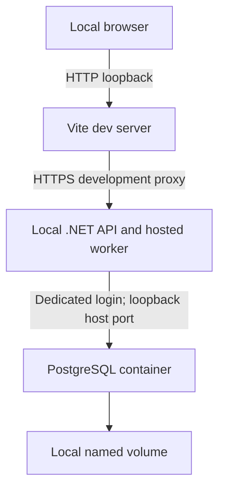

# Threat Model

## Scope

This threat model covers idempotent HTTP intake, PostgreSQL persistence, opt-in Development-only synthetic processing and the read-only operator view. It separates the interactive application's trust boundary from disposable automated test infrastructure. Application data is fictional; real partner connectivity and production deployment are outside the supported scope.

## Interactive Trust Boundary

- API and UI run on the developer workstation. The supported API profile requests https://localhost:7004; Vite requests localhost:5173 and rejects an occupied port.
- Interactive Compose requires a trusted workstation-local Docker engine, including local Docker Desktop/WSL2. Confirm the effective endpoint before supplying credentials or starting/resetting resources: loopback publication and volumes belong to the engine host. A remote context would place resources and send bootstrap credentials elsewhere; it is supported only for disposable test infrastructure, not interactive setup.
- PostgreSQL Compose publishes exactly 127.0.0.1:5432:5432. The server also listens inside its isolated container network so Docker forwarding works; the supported host publication is loopback-only.
- Launch settings, Vite defaults and container configuration can be overridden. They are supported configurations, not guarantees against every operator override. Wider interactive binding requires a new security review.
- Stored and displayed application values must remain synthetic within this boundary.
- The API uses only integration_ops. The login is not a superuser and cannot create roles or databases. It owns the development database so explicit EF migrations can create the schema.
- There are no partner credentials, real partner payloads or outbound partner requests. Database credentials and durable local rows are assets requiring protection.
- Dependency install/audit and container pulls contact external package/image services.

AllowedHosts accepts localhost, 127.0.0.1 and [::1]. It filters request Host values, not listener interfaces or caller identity. A wider listener cannot be secured by this filter alone. The API profile configures only HTTPS; HTTPS redirection does not create another listener. Vite's secure: false bypasses certificate validation for its fixed local API development connection only.

## Disposable Test Infrastructure

Testcontainers uses PostgreSQL 18.6 with generated disposable credentials, synthetic data, random mapped ports and the container-resolved hostname. A remote Docker host is not rejected merely because it is not literal localhost. Tests do not connect to, reset or seed the interactive database.

Use a trusted Docker engine and protect its control endpoint. Mapped test ports follow the Docker environment's networking policy and are not claimed to be loopback-only. No low-level Docker binding customization or production networking guarantee is implied. Test databases are dropped after each test and the shared container is disposed after the suite; interrupted test resources may need cleanup.

## Assets

- Source, dependency locks and pinned image/tool references
- Ignored local bootstrap/application passwords and local User Secrets
- Durable synthetic run metadata, including safe operator error summaries
- Local Docker volume and workstation metadata
- Restricted local diagnostic output

## Threats and Implemented Controls

| Threat | Exposure and control | Remaining limit |
| --- | --- | --- |
| Unauthorized interactive access | Loopback application defaults and database host publication; password-authenticated database login | Local processes with credentials can access the database; no API authentication within this synthetic boundary |
| Host-header abuse | Restricted AllowedHosts and retained HTTP rejection tests | Host filtering does not replace listener verification or authentication |
| Database privilege misuse | Separate bootstrap administrator; API configuration requires integration_ops; bootstrap grants no superuser, create-role or create-database privileges | The app login owns its local database and can change its schema; it is not a least-privilege production runtime identity |
| Credential disclosure | Private passwords in ignored .env; API password in User Secrets or process environment; no credentials in appsettings | User Secrets are not encrypted production storage; local files, shell history and process environment need normal workstation protection |
| Bootstrap interpolation/injection | Quoted shell heredoc, psql getenv and SQL-literal quoting; initialization only on an empty volume | Changing .env does not rotate existing credentials; correct a failed bootstrap before an explicit local reset |
| Invalid durable data | Primary key, required/length/counter/status/timestamp constraints; UTC-only persistence guards; constrained intake-origin lifecycle shapes and error codes | Direct SQL is not subject to the full intake Unicode policy. Seeded snapshots retain their original counters and error descriptions and are excluded from processing |
| Stored error disclosure or XSS | last_error is a bounded fictional operator summary; React renders text; frontend never projects raw response/parser errors | Never populate it with exception messages, SQL, connection details, credentials or real payloads |
| Dependency outage / missing schema | Liveness independent of database; readiness reads required columns; GET returns generic 503 Problem Details for database failures | Readiness is a point-in-time signal, not an availability or worker-progress guarantee; probes disclose only Healthy/Unhealthy |
| Detailed failure disclosure | Generic HTTP errors; no exception/SQL/credential details in readiness responses | Framework diagnostic logs are restricted local output, not operator data; no sensitive-data logging is enabled |
| SQL injection | EF generates parameterized queries; bootstrap uses quoted psql variables | Intake uses parameterized EF writes/lookups; SQL fragments in migration and tests are static, never submitted labels |
| Data loss / retention | Explicit migrations with stopped API instances; no startup migration or seeding; transactional, non-destructive seed preserves matching samples and unrelated rows and rolls back on conflicts; named volume survives container replacement | Mixed-version operation is unsupported. Local synthetic rows persist until explicit volume reset; no backup, retention job or production recovery claim |
| Unbounded list resource use | Asynchronous query with cancellation and timeout; small local synthetic usage only | POST can grow the unpaginated list and durable key index. Transport limits do not cap row count; larger use or broader access needs bounded listing and capacity/rate policy |
| Supply-chain compromise | Locked NuGet/npm dependencies, vulnerability severity policy and pinned PostgreSQL image digest | Locks and pins constrain resolution, not vulnerability exposure or patch safety; audit metadata and updates require review |
| Source/build artifact disclosure | Ignore rules exclude local configuration and build artifacts; shell line-ending control preserves bootstrap script execution | .gitignore does not inspect content, remove tracked secrets or prove safe repository contents; tree and history scanning are separate controls |

## Intake Boundary

The API accepts local synthetic mutation. An untrusted local process can submit new runs; loopback and Host filtering do not authenticate callers. Exposing POST beyond this boundary requires a new security review, identity/authorization and abuse controls. No authentication is claimed here. Requiring JSON and rejecting other content types limits simple browser form submissions; it is not a complete CSRF or local-process defense. There is no permissive CORS policy.

- **Key disclosure:** only SHA-256 of the exact validated ASCII key is stored. Never log or echo raw keys or use credentials as keys. Hashing reduces accidental disclosure, not low-entropy guessing or database-inspector correlation; no HMAC is needed for synthetic local use.
- **Replay/races:** global key scope is intentional without authenticated client identity. The named partial unique PostgreSQL index is the authoritative duplicate gate. Fingerprint plus ordinal normalized-label comparison distinguishes replay from conflict. Partner text is not identity. Authenticated scope would require an explicit migration/contract decision.
- **Input:** bounded actual-byte reads enforce 8192 transport bytes; strict two-property JSON, safe Unicode validation and normalized scalar limits reject malformed/oversized input. Cc/Zl/Zp are rejected; Cf is permitted. Formatting characters may affect visual appearance and labels must not become security identifiers.
- **Stored state:** clients cannot set status/counters/timestamps/errors or hashes. One insert stores a Pending run with zero attempts and records and both hashes atomically. Seeded snapshots have null key hashes and fingerprints. No raw request body or historical response snapshot is persisted. Create, replay and by-ID responses use `Cache-Control: no-store`; replay returns the current state.
- **Failures:** exact named unique violations resolve without custom request-data logging. Other integrity failures remain generic 500; recognized transport/schema failures return generic 503. Framework/EF diagnostics remain restricted local output; sensitive-data logging stays disabled. No SQL/constraint/key/hash/connection diagnostics are exposed in HTTP.
- **Cancellation:** a disconnected request may already have committed. Reusing the same key safely resolves the outcome; cancellation is not a rollback promise.
- **Retention/downgrade:** key metadata lasts as long as the row. Explicit reset ends replay guarantees. Intake and processing downgrades refuse incompatible rows rather than deleting or coercing stored state. Rolling back the initial persistence migration drops the table and its data. No backup, retention service or deletion API exists.

## Processing Boundary

Processing is disabled by default. Enabling `Processing:Enabled` permits automatic mutation of all existing and new intake-origin Pending rows. Seeded snapshots are excluded. Loopback and Host filtering still do not authenticate local callers. Enabling synthetic processing outside Development fails startup; broader exposure requires a new review.

PostgreSQL is the authoritative allocation/fencing store. Random non-secret lease tokens and attempt numbers guard writes; expired/stale computations cannot commit authoritative state. Effective-ready-time ordering lets due retries compete with new work rather than prioritizing unscheduled rows. Each durable claim consumes one of at most three attempts, with a 60-second lease, a 10-second execution deadline and retry delays of 5 then 10 seconds. There is no lease renewal. Pending includes unattempted, leased and retry-waiting work, not just idle runs.

Only six application-controlled error codes enter intake last_error. No raw exception messages, response bodies, SQL, credentials or stack traces are stored or returned. Custom processing logs contain fixed events, run IDs, attempts and safe outcomes, not labels/keys/hashes. Framework/EF diagnostics remain restricted local output; sensitive-data logging stays disabled. Unexpected coordination defects stop the host, whereas processor failures terminate or retry the run according to policy.

No lock/transaction is held during execution. Shutdown stops new claims and cancels execution; interrupted claims remain durable, expire and consume the allocated attempt. Claim or completion acknowledgement ambiguity does not authorize blind retry. The synthetic processor makes no external calls; database fencing does not provide exactly-once external effects. Clock changes, process suspension, unbounded retained local data and loss of earlier error detail remain limitations. No audit history, reconciliation service, real delivery or backup guarantee is implied.

## Validation

- **Repeatable checks:** `scripts/Verify.ps1` runs locked restore, warning-as-error build, backend tests, formatting, EF model-drift checks, dependency audits, frontend lint/tests and a production UI build. Missing Docker fails database verification rather than silently skipping it.
- **HTTP and persistence tests:** `WebApplicationFactory` and real PostgreSQL Testcontainers exercise Host rejection, strict intake, create/replay/conflict, concurrent duplicate arbitration, by-ID reads, constraints, migration guards, seed conflicts, cancellation and generic failure responses.
- **Processing tests:** database-backed tests exercise allocation, lease expiry, stale completion, bounded retries and recovery. Retry-wait restart, container pause/unpause and a force-stop during active leased execution are distinct scenarios; one does not establish the others.
- **Operator view tests:** Vitest, jsdom and mocked HTTP responses cover rendering and runtime payload validation. The UI distinguishes loading, empty, network, HTTP and invalid-payload states without projecting raw parser errors. It shows a snapshot and requires reload; it is not a live progress monitor or database lifecycle validator.
- **Interactive checks:** inspect actual listener interfaces, Host rejection, local HTTPS, database-login privileges, browser layout, accessibility, network behavior and outage states separately. HTTP/component tests do not establish those runtime properties.
- **Recovery checks:** verify that database outage leaves liveness healthy while readiness and reads fail generically, and that the same API host recovers persisted reads when the database returns at the stable endpoint. Fresh-volume migrations and seeding are not backup/restore tests; retained-volume durability is not recovery from volume loss.

Validation must distinguish application behavior from deployment properties such as listener interfaces, TLS configuration and database privileges.

## Supply Chain and Secret Protection

Use the reusable [review checklist](REVIEW-CHECKLIST.md) for dependency and repository checks. Locked restores and the pinned PostgreSQL digest make dependency selection deliberate; they do not guarantee vulnerability-free artifacts or safe patches. Review dependency and image updates and verify their behavior rather than treating an unchanged pin or a successful audit as sufficient assurance.

NuGet auditing includes direct and transitive dependencies and blocks on any reported vulnerability. npm auditing includes development dependencies and blocks on moderate or higher findings; low findings still require review. Audit metadata is time-bound, and failed or unavailable audits are not clean results.

Inspect repository contents and scan both the working tree and Git history for secrets. A working-tree scan does not cover history, and no scan proves the absence of every secret. `.gitignore` is not secret protection: it does not inspect file contents, remove already tracked values or protect local credentials from workstation access. Keep bootstrap and application credentials out of source, build artifacts and logs.

## Before Expanding Exposure

Real data, wider network binding or deployment requires a separate security and operational design with the following controls. These are exposure conditions, not an implementation roadmap.

1. Define operator versus partner identity boundaries; authenticate by default and authorize each query.
2. Prevent cross-partner/tenant access and classify all stored fields.
3. Define retention and deletion policies, backup/restore procedures and controlled migration execution.
4. Use an approved secret store, separate runtime/migration privileges and production transport security.
5. Retain generic operator errors; protect restricted diagnostics and redact sensitive values.
6. Define audit events without storing credentials or sensitive payloads.
7. Enforce bounded listing, request limits, capacity limits and rate limiting.
8. Protect any detailed dependency-health information; keep public liveness minimal.
9. Define TLS, exact hosts, proxy trust and browser headers.
10. Test denial, object-level authorization, log redaction and recovery.

**AI-assisted:** Yes
